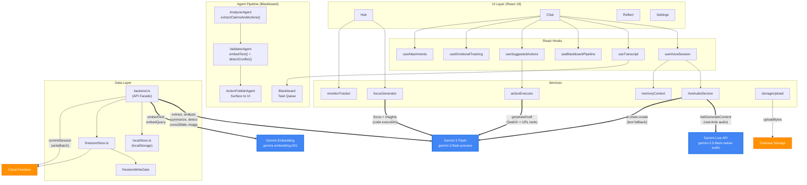

# Second-Self

**An Autonomous Life Operating System powered by Gemini 3**

Second-Self is a voice-first mobile web app that acts as your AI-powered personal memory and life management companion. It captures conversations through natural voice interaction, extracts knowledge in real-time, tracks goals, understands emotions, and takes action on your behalf — all with transparent evidence and user-controlled permissions.

**Zero backend server** — the entire application runs client-side with direct Gemini API calls via `@google/genai`, making it deployable as a static site on Firebase Hosting.

## Live Demo

**[https://studio-893689625-b2f3e.web.app](https://studio-893689625-b2f3e.web.app)**

Sign in with Google or use the Demo account to explore with pre-populated data.

---

## Gemini Integration

Second-Self is built around **three Gemini models** working together across **15+ integration points**:

| Model | Role | Integration Points |
|-------|------|-------------------|
| `gemini-3-flash-preview` | Text intelligence engine | Claim extraction, action detection, conflict detection, emotion analysis, transcript summarization, memory consolidation, image analysis (agentic vision), action draft generation, goal milestone generation, goal check-in coaching, daily focus prioritization, insight computation, text-only chat fallback |
| `gemini-2.5-flash-native-audio-preview-12-2025` | Real-time voice conversation | Live WebSocket audio I/O, server-side transcription, barge-in detection, voice activity detection |
| `gemini-embedding-001` | Semantic understanding | Claim deduplication, action deduplication, conversation search, conversation embedding, similarity matching |

### Gemini Feature Usage

| Gemini Feature | Where Used | Source File |
|----------------|------------|-------------|
| **Live API (bidiGenerateContent)** | Real-time voice conversations with bidirectional audio streaming | `liveAudioService.ts` |
| **Native Audio Model** | Voice input/output with Kore voice, echo cancellation, VAD | `liveAudioService.ts` |
| **Server-side Transcription** | Automatic speech-to-text for both user and assistant turns | `liveAudioService.ts` |
| **Structured JSON Output** | Claim/action extraction, emotion detection, goal milestones, check-in coaching | `backend.ts` |
| **Thinking Mode** (LOW/MEDIUM/HIGH) | HIGH: conflict detection; MEDIUM: goal check-in coaching; LOW: claim extraction, memory consolidation, image analysis | `backend.ts` |
| **Thought Signatures** | Cross-turn reasoning continuity during claim/action extraction | `backend.ts` → `extractClaimsAndActions()` |
| **Streaming Responses** | `sendMessageStream()` for text-only chat with progressive output | `liveAudioService.ts` |
| **Text Embeddings** | 768-dim vectors for semantic similarity, deduplication, and search | `backend.ts` → `embedText()` |
| **Code Execution Tool** | Image analysis with agentic vision (Think/Act/Observe), daily focus prioritization | `backend.ts` → `analyzeImage()`, `focusGenerator.ts` |
| **Google Search Tool** | Action draft generation, goal milestone suggestions, check-in coaching | `actionExecutor.ts`, `backend.ts` |
| **URL Context Tool** | Action execution with web page understanding | `actionExecutor.ts` |
| **Context Caching** | Automatic cache hit tracking via `usageMetadata.cachedContentTokenCount` | `backend.ts` → `logCacheMetrics()` |
| **Media Resolution Control** | High-resolution image analysis for agentic vision | `backend.ts` → `analyzeImage()` |

### Gemini Integration Architecture

Every Gemini call flows through one of three paths:

1. **Voice path**: `liveAudioService.ts` → Gemini Live API (`bidiGenerateContent` WebSocket) → real-time audio I/O with server-side transcription
2. **Text intelligence path**: `backend.ts` → `generateText()` / `generateJson()` → Gemini 3 Flash REST API → structured extraction, analysis, and generation
3. **Semantic path**: `backend.ts` → `embedText()` / `embedQuery()` → Gemini Embedding API → 768-dim vectors for similarity and search

---

## Architecture



**Thick blue nodes = Gemini API integration points**

---

## Features

### Voice-First Conversations
- **Gemini Live API** for real-time bidirectional audio with the Kore voice
- Automatic server-side transcription for both speakers
- Barge-in detection when the user interrupts
- Text input during voice sessions via `sendClientContent`
- Automatic fallback to text-only chat (**Gemini 3 Flash** via `ai.chats.create()` + `sendMessageStream()`) when microphone is unavailable
- Dynamic system prompts built from user memory (claims, goals, actions, 3 most recent conversations, rolling memory summary)
- Context-aware auto-greeting that addresses the user by name and references urgent actions or recent conversations

### Real-Time Knowledge Extraction
- **Blackboard agent pipeline** processes conversation turns as they happen
- **AnalyzerAgent** calls **Gemini 3 Flash** with structured JSON output and **thinking mode (LOW)** to extract claims and actions; preserves **thought signatures** across turns for reasoning continuity; performs in-session deduplication
- **ValidatorAgent** uses **Gemini Embeddings** for semantic deduplication (cosine similarity >= 0.9 merges, 0.7-0.9 triggers **Gemini 3 Flash** conflict detection with **thinking mode HIGH**)
- **ActionPublishAgent** surfaces validated actions to the UI in real-time
- Evidence trails ("receipts") link every AI claim back to the source conversation

### Autonomous Action Execution
- Three permission levels: **Suggest Only**, **Draft & Review**, **Execute Now**
- Action drafts generated by **Gemini 3 Flash** with **Google Search** and **URL Context** tools for real-time web context
- Per-action-type permission overrides in Settings
- Real-time action cards in the Chat action bar with approve/dismiss controls
- Action types: reminder, email, calendar, goal, reading, general

### Memory & Knowledge Graph
- Rolling memory summary (500-word cap) consolidated by **Gemini 3 Flash** (thinking mode LOW) at each session end
- Dynamic system prompts assembled from claims (50), actions (30), goals (10), and 3 most recent conversations
- Context-aware greetings that reference urgent actions, recent conversations, and user name
- Semantic search across conversations and claims using **Gemini Embeddings**
- Crash recovery: uncommitted sessions detected on app load and automatically flushed to Firestore

### Emotional Intelligence
- Real-time emotion detection from transcript text via **Gemini 3 Flash** with structured JSON schema
- Emotional state tracking: joy, sadness, anger, fear, surprise, stress, calm, neutral
- Valence (-1 to 1), intensity (0 to 1), and confidence scoring
- Longitudinal trend analysis (dominant emotion, mood arc, weekly patterns) and wellness suggestions
- Emotional summary in session recaps with conversation arc visualization (improving/stable/declining)

### Goal & Accountability
- Goal creation with AI-suggested milestones (powered by **Gemini 3 Flash** with **Google Search** tool)
- Progress tracking with milestone completion and check-in flows
- AI coaching responses via **Gemini 3 Flash** with **thinking mode MEDIUM** and **Google Search**
- Goal categories: health, career, learning, relationships, finance, personal
- Goal-linked actions and insights

### Proactive Intelligence (Hub)
- **Today's Focus**: AI-prioritized daily items using **Gemini 3 Flash** with **code execution** tool
- **Insights**: Pattern detection, memory surfacing, wellness checks, goal progress — computed using **Gemini 3 Flash** with **code execution**
- Time-of-day aware greeting with emotional context
- Attention indicators for due items and review queue

### Session Recap
- AI-generated summary with emotional context (via **Gemini 3 Flash** `summarizeTranscript()`)
- Conversation embedding for semantic search (via **Gemini Embeddings**)
- Knowledge inferred (claims) with expandable evidence
- Action categorization: confirmed, suggested, rejected (recoverable)
- Conflict detection with review queue (severity badges)
- Memory summary consolidation into rolling 500-word summary
- **Deferred Firestore commit**: all data writes batch at recap close via `writeBatch`, not during conversation
- Cloud upload of transcript, attachments, and photos to Firebase Storage

### Image Analysis (Agentic Vision)
- Photo capture with live camera viewfinder
- File attachment support for documents and images
- **Gemini 3 Flash** with **code execution** tool, **thinking mode LOW**, and **high media resolution** for intelligent extraction from photos (receipts, schedules, charts, documents, business cards)
- Agentic Think/Act/Observe pattern with automatic retry (3 attempts with exponential backoff)

### Review Queue (Conflict Resolution)
- AI-detected claim conflicts surfaced with severity badges (low/medium/high)
- Side-by-side claim comparison with date labels and "Newest" indicators
- Resolution options: confirm selected, merge with AI-suggested text
- Conflicts detected via embedding similarity (0.7-0.9 range) + LLM confirmation

---

## Tech Stack

| Layer | Technology |
|-------|-----------|
| Frontend | React 19 + TypeScript + Vite |
| AI - Voice | Gemini Live API (`gemini-2.5-flash-native-audio-preview-12-2025`) |
| AI - Text | Gemini 3 Flash (`gemini-3-flash-preview`) |
| AI - Embeddings | Gemini Embedding (`gemini-embedding-001`) |
| AI SDK | `@google/genai` ^1.30.0 (client-side, no backend relay) |
| Auth | Firebase Authentication (Google OAuth) |
| Database | localStorage (primary) + Cloud Firestore (persistent sync) |
| Storage | Firebase Cloud Storage (transcripts, photos, attachments) |
| Hosting | Firebase Hosting |
| Routing | React Router DOM ^7.12.0 |
| Testing | Vitest ^4.0.17 (unit/integration) + Playwright ^1.57.0 (E2E/user-flow) |

### Key Dependencies

```json
{
  "@google/genai": "^1.30.0",
  "firebase": "^12.8.0",
  "react": "^19.2.0",
  "react-dom": "^19.2.0",
  "react-router-dom": "^7.12.0"
}
```

---

## Getting Started

### Prerequisites
- Node.js 18+
- Gemini API key ([Google AI Studio](https://aistudio.google.com/apikey))
- Firebase project (for auth and cloud sync)

### Local Development

```bash
cd app
cp .env.example .env
# Edit .env with your API keys
npm install
npm run dev
```

### Deploy to Firebase Hosting

```bash
cd app
npm run deploy
```

See [DEPLOYMENT_GUIDE.md](./DEPLOYMENT_GUIDE.md) for detailed setup.

---

## Testing

```bash
# Unit tests (44 test files)
npm run test:unit

# Integration tests (Gemini API, Firebase, backend utilities)
npm run test:integration

# E2E tests (Playwright - UI flows, navigation, components)
npm run test:e2e

# E2E user flow - text mode (10-turn conversation + recap + validation)
npm run test:user-flow

# E2E user flow - live audio mode (Gemini Live API with simulated microphone)
npm run test:user-flow-live

# E2E user flow - image attachment mode
npm run test:user-flow-image
```

The user-flow tests run full 15-turn multi-session conversations with Gemini, validate knowledge extraction accuracy, and verify cross-session memory continuity — all automatically judged by Gemini itself.

---

## Project Structure

```
second-self/
  app/
    src/
      agents/          # AnalyzerAgent, ValidatorAgent, ActionPublishAgent
      api/             # backend.ts (API facade + Gemini calls), localStore.ts
      auth/            # AuthProvider, AuthGate
      blackboard/      # Blackboard task queue + event bus
      components/      # React UI components (chat/, goals, insights, etc.)
      hooks/           # useVoiceSession, useTranscript, useSuggestedActions,
                       # useBlackboardPipeline, useEmotionalTracking, useAttachments
      lib/             # Firebase init, analytics, evidence utils
      openloops/       # Open loops (follow-ups) context provider
      pages/           # Hub, Chat, Reflect, Settings, Login
      profile/         # ProfileProvider (React Context)
      reflect/         # reflectData.ts (data transformation)
      services/        # liveAudioService, focusGenerator, actionExecutor,
                       # emotionTracker, memoryContext, storageUpload,
                       # firestoreStore, firestoreSync, firestoreWriteGate
      tools/           # toolPrompts.ts (tool prompt templates)
      utils/           # demoSeed.ts
    scripts/
      demo.mjs         # Automated demo video recording
      deploy.mjs       # Firebase Hosting deployment
      push-demo-data.ts    # Populate Firestore with demo data
      delete-demo-data.ts  # Clean Firestore demo data
    tests/
      unit/            # 44 test files (components, agents, services, backend)
      integration/     # 6 test files (Gemini API, Firebase, backend utilities)
      e2e/             # 10 spec files (UI flows, navigation, reflect, settings)
      other/           # 3 user-flow specs (text, audio, image)
  demo/                # Demo data JSON files
  doc/                 # Architecture diagrams (Mermaid, draw.io)
  firebase/            # Firestore rules, Storage rules
```

---

## Data Architecture

### Deferred Write Pattern

During active voice/chat sessions, **all Firestore writes are deferred**. localStorage is the sole source of truth during conversation. At recap close, the complete session state is batch-written to Firestore via `writeBatch`:

```
Session Active                          Recap Close
    |                                       |
    v                                       v
localStorage only  ──────────────>  writeBatch to Firestore
(claims, actions,                   (conversation, claims,
 transcript, emotions)               actions, memorySummary,
                                     review queue items)
```

This ensures zero data loss even if the browser closes mid-session (crash recovery detects uncommitted sessions on next app load).

### Storage Layout

| Store | Data |
|-------|------|
| localStorage | User profile, claims, goals, actions, conversations, review queue, embeddings |
| Cloud Firestore | Persistent sync of all entities under `users/{uid}/` subcollections |
| Firebase Storage | `users/{uid}/conversations/{id}/transcript.json`, attachments, photos |

---

## License

Built for the [Gemini 3 Hackathon](https://gemini3.devpost.com/)
